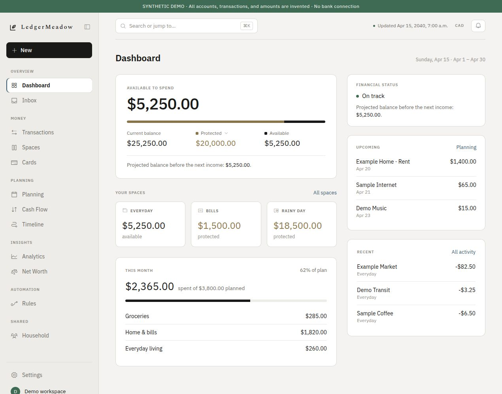
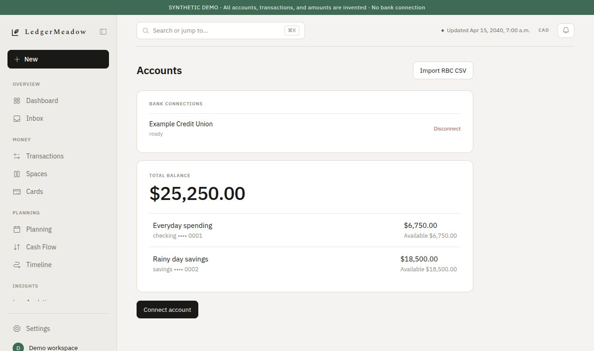
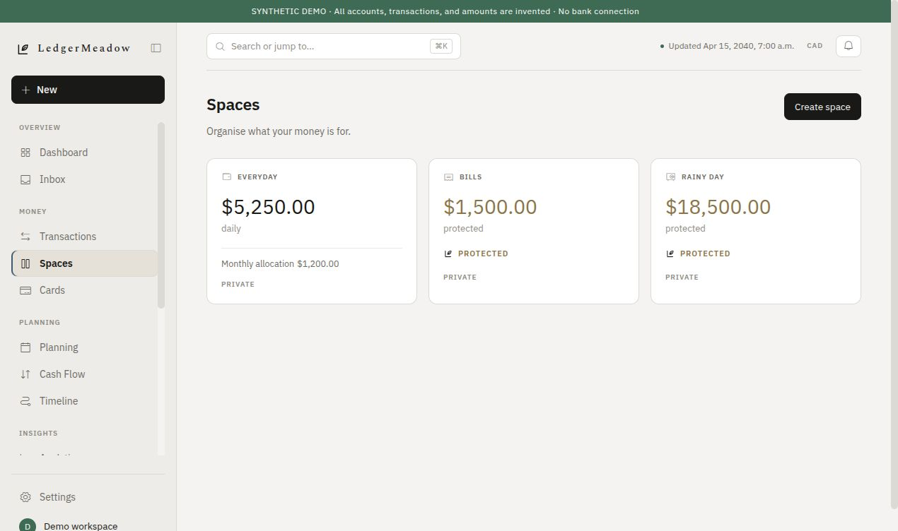

# LedgerMeadow

A personal-finance application for understanding connected accounts, organizing spending, and planning ahead. The repository contains a React frontend, Go API, and Rust financial engine with shared API contracts.

**Development release.** Source publication and automated checks do not establish production readiness for real bank accounts. Use your own isolated development configuration and synthetic data or provider sandbox accounts. Read [security and deployment status](docs/SECURITY_STATUS.md) before running the application beyond your workstation.

## Screenshots

The running React interface with **synthetic demo data**. Every displayed account, merchant, transaction, date, and amount was invented for these captures. No live bank account, private database, or authentication credential was used. See [screenshot provenance and review requirements](docs/screenshots/README.md).



<details>
<summary>Accounts and spaces</summary>





</details>

## What is implemented

- Connected-account and transaction views, Plaid integration, and an RBC CSV importer.
- Categories, budgets, spaces, bills, subscriptions, goals, debt scenarios, and net-worth calculations.
- Household sharing, planning, notifications, and an inbox for review actions.
- Checked integer money calculations in Rust, consumed by Go over protobuf/gRPC.
- Clerk-based authentication, ownership-scoped queries, encrypted bank-provider credentials, verified webhooks, and durable background processing.

These are development capabilities with tests, not claims of financial accuracy or complete production security. No payments are moved. Card screens describe planning previews; they do not issue or control payment cards. Plaid is the implemented bank adapter; other provider names do not imply completed integrations.

## Architecture

The three applications stay in one monorepo:

| Directory | Responsibility |
| --- | --- |
| `apps/web` | React/TypeScript presentation and authenticated API calls |
| `apps/api` | Go authentication, authorization, PostgreSQL access, imports, bank integrations, jobs |
| `apps/financial-engine` | Rust financial computation behind private gRPC |
| `contracts` | OpenAPI schema, generated TypeScript client, and protobuf contract |
| `db/migrations` | Database schema and migrations; no financial records or database dumps |
| `scripts` | Local startup, migration, and publication checks |
| `infra/docker` | Separate API and engine image definitions |

Request flow is browser → Go → Rust → Go → browser. The browser never connects to the database or engine. The Go API owns all authentication and authorization decisions. The current engine connection is limited to literal loopback addresses on a trusted host or shared network namespace; distributed deployment requires authenticated encrypted transport first.

## Install and test without credentials

CI uses Go **1.26.7**, Rust **1.92.0**, Node **22**, and npm. Python **3.12+** runs repository checks. PostgreSQL and banking credentials are not needed for the default unit tests.

```bash
cd apps/api
go mod download
go build ./...
go test ./...
cd ../financial-engine
cargo test --locked
cd ../web
npm ci --ignore-scripts
npm run lint
npm test
npm run build
cd ../..
python3 -m unittest discover -s tests -v
```

The frontend build does not need a real Clerk key. Interactive sign-in does require your own development Clerk application. Install dependencies from committed lockfiles; never copy a working application's `node_modules`, binaries, or build output into the repository.

## Local interactive development

1. Create an isolated local PostgreSQL database and a Clerk development application. Use Plaid Sandbox, not a live bank account, while evaluating this release.
2. Copy `apps/api/.env.example` and `apps/web/.env.example` to `.env.local` beside each example. Supply your own values privately. Empty entries are intentional. These files are ignored and never provided by this repository.
3. Set `DATABASE_URL` and `DATABASE_DIRECT_URL` to your local development database. For the database-creation helper, set `POSTGRES_ADMIN_URL` to a loopback administrator connection; the target database name comes from `DATABASE_URL`. With pooling, the listener and migrations need a direct connection.
4. Keep `CLERK_SECRET_KEY`, Plaid credentials, database URLs, and encryption material on the API side. Only `VITE_CLERK_PUBLISHABLE_KEY` and `VITE_API_BASE_URL` belong in the web configuration.
5. Generate a new local encryption key without displaying it:

```bash
mkdir -p apps/api/.local-secrets
chmod 700 apps/api/.local-secrets
openssl rand -out apps/api/.local-secrets/provider-tokens.key 32
chmod 600 apps/api/.local-secrets/provider-tokens.key
```

Keep the same key for the same private development database; replacing it makes existing encrypted provider tokens unreadable. Production key management is unfinished—see the security status document.

```bash
./scripts/create-local-db.sh
./scripts/migrate-local-db.sh
./scripts/run-local.sh
```

Open the loopback web address configured for Vite (normally `http://127.0.0.1:5173`). The startup script gives the engine only its address and the web process only public browser configuration. API credentials are not inherited by those application processes.

Use the same frontend origin for `WEB_ORIGIN` and `CLERK_AUTHORIZED_PARTIES`. Keep `FINANCIAL_ENGINE_ADDR` on a literal loopback address, such as `127.0.0.1:50051`. The API and engine reject remote or wildcard engine addresses. Never forward the engine or database port publicly.

## Data, privacy, and tests

No credentials, real bank statements, transactions, account records, database exports, or private deployment endpoints are supplied. The CSV parser fixture and subscription history fixture are explicitly synthetic, with provenance notes beside them. Other tests use synthetic inputs and local mock services.

Environment files, encryption keys, financial documents, logs, unreviewed images, dependency folders, and build outputs are excluded by repository rules and publication checks. The only raster images allowed are the exact reviewed synthetic screenshots above. Font and icon CSS is bundled from pinned packages rather than loaded from third-party stylesheets. Clerk and Plaid remain external services when you configure and use their integrations.

Before any push, stage the intended files and run:

```bash
python3 scripts/check_publication.py
```

CI also scans the complete Git history for secrets and checks source, tests, builds, and dependencies. No private credentials or data are supplied to CI, and it does not deploy the application or upload build artifacts.

## License

[PolyForm Noncommercial 1.0.0](LICENSE). This is source-available software under noncommercial terms, not OSI-approved open source. See [NOTICE](NOTICE) and [third-party notices](docs/THIRD_PARTY.md). Commercial use requires a separate license from the rights holder.

Contributions: [CONTRIBUTING.md](CONTRIBUTING.md). Private security reports: [SECURITY.md](SECURITY.md).
